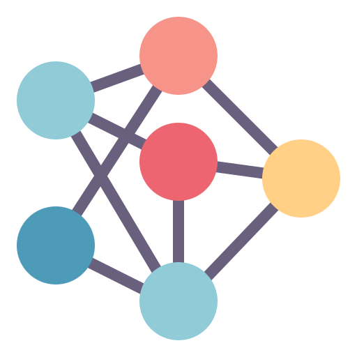

<h1 align="center" id="title">Hadoop MapReduce KMeans Clustering</h1>

 
  

    

The project involves the implementation of the K-Means clustering algorithm using Hadoop MapReduce. The objective is to develop an application that allows clustering to be performed on datasets of different dimensions and with different configurations of centroids and points.
 The Hadoop MapReduce framework has been utilized to parallelize the algorithm and improve its scalability.

  
<h2>🧐 Study:</h2>

A Python script has been developed that utilizes the "make blobs" module from "scikit-learn" to generate datasets of specified sizes and dimensions. 

The dimension and the structure of the dataset relies on specific parameters: 
- **n**: number of points/observations;
- **k**: number of clusters;
- **d**: number of dimension of the points/observations;

The algorithm is tested and evaluated on seven different datasets, with variations in n, k and d.  

The tests, which are in the <a href="https://github.com/FedericoMontini98/Hadoop_K-means/scripts/data">scripts/data</a> directory,  were evaluated using a MATLAB plot for datasets with dimensions less than or equal to 3. For datasets with dimensions greater than 3, the Silhouette score was used to evaluate the algorithm's performance. However, for two tests, the results were not satisfactory, and the K-Means++ algorithm was used instead, which resulted in better performance. Additionally, the impact of the number of reducers on algorithm execution time was examined, and the average execution time for one iteration of the algorithm was recorded for different numbers of reducers. See the documentation in the <a href="https://github.com/FedericoMontini98/Hadoop_K-means/docs/">docs</a> directory for further details.

<h2>💖Like my work?</h2>

Contact me if you have any corrections or additional features to offer.

<h2>👥 Authors:</h2>
<ul>
<li><a href="https://github.com/FedericoMontini98">Federico Montini</a></li>
  <li><a href="https://github.com/FabrizioLanzillo">Fabrizio Lanzillo</a></li>
  <li><a href="https://github.com/mirawara">Lorenzo Mirabella</a></li>
</ul>

